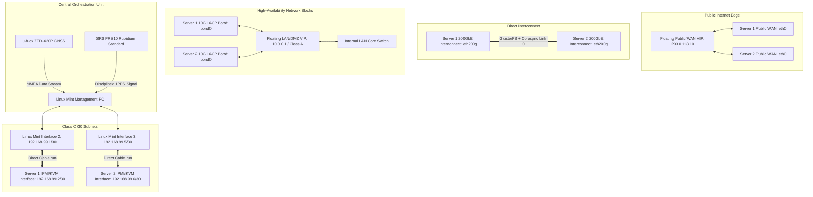

## Section 1. Master Architecture Topology

### Infrastructure Network Matrix

| Network Path | Interface Role | Subnet / Mask | Mint Side Host IP | Server Target IP |
| :--- | :--- | :--- | :--- | :--- |
| **KVM Link 1** | Server 1 Boot / Time / QDevice | `192.168.99.0/30` | `192.168.99.1` | `192.168.99.2` |
| **KVM Link 2** | Server 2 Boot / Time / QDevice | `192.168.99.4/30` | `192.168.99.5` | `192.168.99.6` |
| **Interconnect** | Distributed Storage Sync Loop | `10.200.0.0/24` | — | `.1` (S1) / `.2` (S2) |
| **Internal LAN** | VM Bridging & Host Routing | `10.0.0.0/8` | — | `.11` (S1) / `.12` (S2) |
| **DMZ Network** | Isolated Guest Allocations | `172.16.0.0/16` | — | Dynamic VM Routing |
| **Public WAN** | Redundant External Uplinks | *ISP Assigned* | — | Assigned IPs / Floating VIP |
